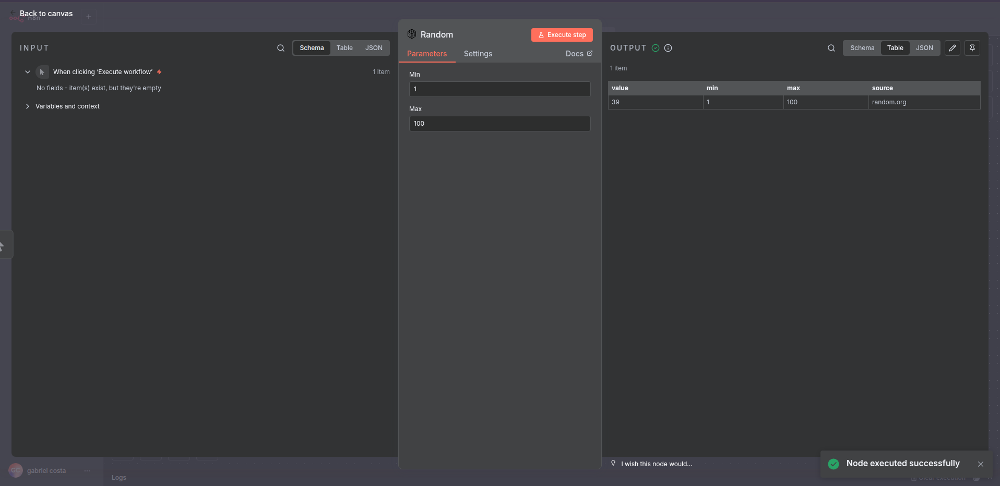

# 🎲 n8n-nodes-random

**Gerador de Números Aleatórios Verdadeiros para n8n** — um node customizado que utiliza a [Random.org](https://www.random.org/) para gerar inteiros verdadeiramente aleatórios entre um valor mínimo e máximo.
---

## 📦 Funcionalidades

* ✅ Gera **números aleatórios verdadeiros** via Random.org
* ✅ Inputs configuráveis **Min** e **Max** (inclusivos)
* ✅ Mensagens de erro claras para entradas inválidas
* ✅ Empacotado como um node custom padrão do n8n (`.n8n/custom`)
* ✅ Compatível com setup local usando **Docker Compose + Postgres**
* ✅ Testado com **Jest**

---

## 🚀 Como começar

### 1. Clone o repositório

```bash
git clone git@github.com:gabriel777assuncao/True-Random-Number-Generator.git
cd True-Random-Number-Generator
```

### 2. Configure o .env

Copie o arquivo de exemplo e ajuste as variáveis conforme necessário:

```bash
cp .env.example .env
```

### 3. Instale as dependências

```bash
cd node
npm install
```

### 4. Compile o node

```bash
npm run build
```

Isso vai gerar os arquivos em `dist/` e copiar o ícone SVG.

### 5. Suba a infraestrutura do n8n com Docker

Na raiz do projeto (onde está o `docker-compose.yaml`):

```bash
---
docker compose up -d
docker compose restart n8n
---

## 🧩 Uso no n8n

1. Acesse o **Editor do n8n** em [http://localhost:5678](http://localhost:5678).
2. Procure por **Random** na paleta de nodes.
3. Arraste o node para o seu workflow.
4. Configure:

   * **Min** → valor inteiro mínimo (inclusivo)
   * **Max** → valor inteiro máximo (inclusivo)
5. Execute o workflow → a saída será semelhante a:

```json
{
  "value": 42,
  "min": 1,
  "max": 100
}
```

---

## 🧪 Executando os testes

Utilizamos **Jest** para testes unitários.

```bash
npm test
```

Exemplo de saída:

```
PASS  tests/Random.node.test.ts
✓ deve gerar um número aleatório (10 ms)
✓ deve lançar NodeOperationError quando Min > Max
✓ deve lançar NodeOperationError quando os valores não forem inteiros
```

---

## 📂 Estrutura do projeto

```
True-Random-Number-Generator/
├── docker-compose.yaml
├── .env.example                  # exemplo de variáveis
├── .env                          # (gitignored)
├── README.md
├── image.png                     # screenshot do node
└── node/                         # pacote do custom node (n8n-nodes-random)
    ├── package.json
    ├── tsconfig.json
    ├── jest.config.js
    ├── dist/                     # build gerado pelo TypeScript
    ├── src/
    │   ├── Random.node.ts        # implementação do Node
    │   ├── assets/
    │   │   └── random.svg        # ícone do node (copiado no build)
    │   ├── core/
    │   │   ├── exceptions/
    │   │   │   └── ValidationError.ts
    |   |   |   └── Errors.ts
    |   |   |    
    │   │   ├── interfaces/
    │   │   │   └── IHttpClient.ts
    │   │   └── services/
    │   │       └── RandomOrgClient.ts
    │ 
    └── tests/                    # testes Jest
        └── Random.node.test.ts
```

---

## 🖼️ Screenshots



## 🙏 Agradecimentos
Agradeço desde já pela oportunidade de fazer parte do processo, espero que gostem! 🚀

Caso queira entender melhor sobre cada processo do desenvolvimento, criei um GitHub Project para esse repositório.
Está disponível em: https://github.com/users/gabriel777assuncao/projects/7
